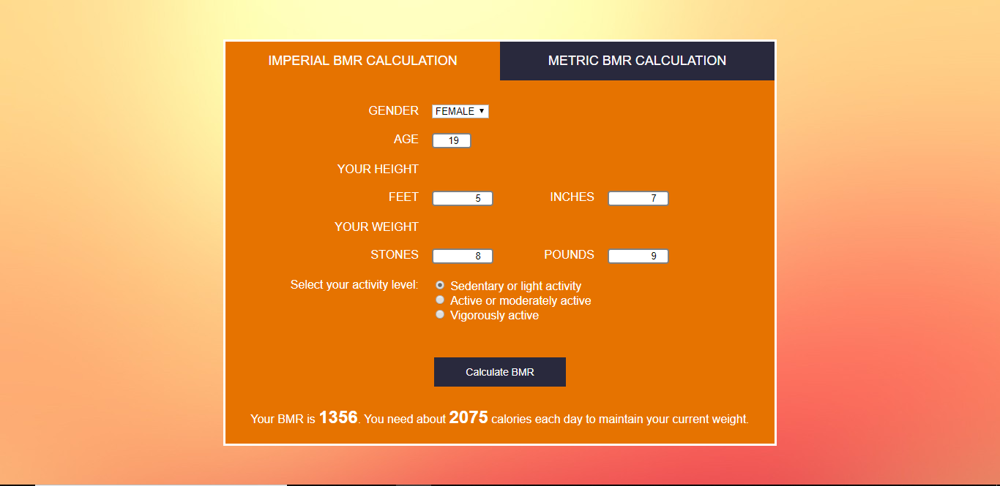

# BMR-Calculator
javascript Calculator to calculate BMR

BMR calculator The Basal Metabolic Rate (BMR) Calculator estimates basal metabolic rate—the amount of energy expended while at rest in a neutrally temperate environment, and in a post-absorptive state.
This calculator provides facility to measure BMR based upon three activity levels.

## Screenshot
 
